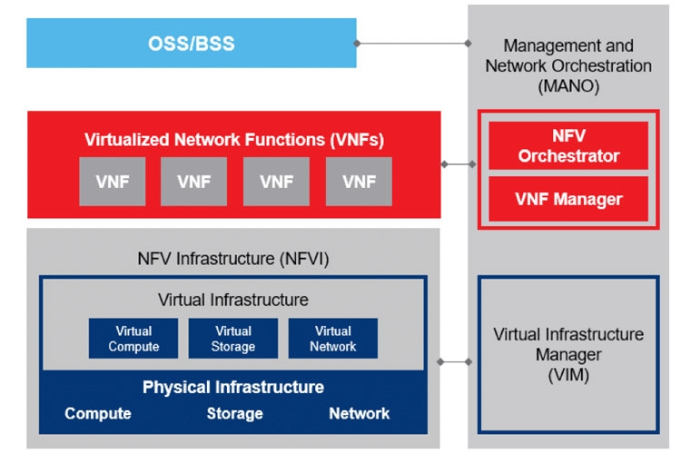

ONAP là một bộ sưu tập các giải pháp tự động hóa mạng. Những giải pháp này bao gồm điều phối, quản lý và tự động hóa

Thử thách mà ONAP đặt ra là giúp đỡ các nhà vận hành mạng:

- Quản lý quy mô và chi phí của những thay đổi thủ công khi cần triển khai các dịch vụ mới.
- Tận dụng SDN và NFV để đẩy nhanh tốc độ cung cấp dịch vụ.
- Có một hệ thống giám sát để đảm bảo các cam kết chất lượng dịch vụ (SLA).

## Kiến trúc tổng quan

Kiến trúc của ONAP dựa trên một mô hình lý thuyết tiêu chuẩn, đó là mô hình NFV của ETSI (Viện Tiêu Chuẩn Viễn Thông Châu Âu). Trong đó, lớp MANO trong mô hình có mối quan hệ cực kỳ mật thiết.

nói một cách dễ hiểu ETSI NFV là bản vẽ kiến trúc tiêu chuẩn lý thuyết, còn ONAP là một phần mềm mã nguồn mở thực tế đã hiện thực hóa bản vẽ đó (và thậm chí còn làm được nhiều hơn thế).

Kiến trúc của ONAP có thể được chia làm 3 phần:

- Phần thiết kế (Design Time)
- Phần triển khai (Run Time)
- Phần quản lý (OOM)

## Quá trình tinh gọn

ONAP ban đầu được xây dựng theo kiến trúc Monolithic, tức là toàn bộ phần mềm được phát triển, đóng gói và triển khai theo một khối thống nhất; giao diện, logic nghiệp vụ và cơ sở dữ liệu kết hợp chặt chẽ với nhau.

Giờ đây, ONAP được triển khai theo cấu trúc micro services bao gồm các chức năng tự động hóa và bảo mật trong hệ sinh thái Linux Network Foundations (LNF)

Quá trình tinh gọn này hướng tới mục đích:

- Tạo ra các giao diện trừu tượng dựa trên tiêu chuẩn nhất định, sử dụng declarative APIs, tức là thay vì phải ra lệnh từng bước một, ta chỉ cần sử dụng giao diện đơn giản để định nghĩa trạng thái mong muốn (Intent-based). Hệ thống sẽ tự động tính toán để đạt được trạng thái đó.
- Các thành phần này có thể hoạt động không phải phụ thuộc cứng nhắc vào nhau mà có thể tự vận hành độc lập và xử lý nhiệm vụ riêng biệt.
- Phù hợp hơn với quy trình CI/CD

## Kiến trúc chi tiết

### 1. Phần thiết kế (Design-time)

ONAP cung cấp hẳn một hệ thống đồ sộ là **SDC (Service Design and Creation)** để các kỹ sư thiết kế, đóng gói và thử nghiệm các dịch vụ mạng trước khi thực sự triển khai vào môi trường Production

Thành phần của ONAP Design-time bao gồm

- Service/xNF Design
- xNF Onboarding
- Workflow Designer
- Catalog

**Service/xNF Design**

Để hiểu được, trước tiên cần làm rõ thuật ngữ xNF (x Network Function):

- PNF (Physical Network Function): Chức năng mạng vật lý truyền thống, nằm trên các thiết bị chuyên dụng.
- VNF (Virtual Network Function): Chức năng ảo hóa, chạy trên các máy ảo, với thiết bị là các máy tính có kiến trúc tập lệnh 64 bit.
- CNF (Containerized/Cloud-native Network Function) chạy trên các Container

Tiếp thoe là thuật ngữ Service Design:

Các xNF đứng một mình không tạo ra giá trị cho người dùng, ta cần phải lắp ráp nhiều xNF lại với nhau, cấu hình mạng (network, subnet, IP, …) và thiết lập policies để tạo ra một hệ thống hoàn chỉnh

⇒ Service/xNF Design là quá trình mô hình hóa, định nghĩa kiến trúc và tạo ra các bản thiết kế cho các dịch vụ mạng trước khi được đưa vào triển khai thực tế.

**xNF Onboarding**

Đây là quá trình “nhập kho” và “kiểm đinh” khi một chức năng mới từ vendor được đưa và hệ thống. 

Trước khi được đưa vào production, người quản trị cần phải kiểm tra chức năng mạng trên có ảnh hưởng tới hệ thống thực tế không.

- Đầu vào sẽ là một gói VPS (Vendor Software Product)
    - Gói này sẽ chứa toàn bộ những thứ liên quan tới chức năng mạng đó
    - Với CNF, gói này sẽ thường chứa Helm Charts, một trình quản lý gói, các tệp cấu hình YAML K8s, các đường dẫn tới các Docker Images
    - Với VNF, Gói này chứa các **HEAT templates** (để tạo máy ảo trên OpenStack) và các file image hệ điều hành (như qcow2).
    - Thông tin đi kèm bao gồm yêu cầu tài nguyên (Cần bao nhiêu CPU, RAM, các file script cấu hình, và License)

⇒ Khi Upload gói này nên SDC, Quá trình Onboard sẽ chạy qua bốn bước kiểm định

1. Validation
2. Translation 
3. Enrichment
4. Certification
